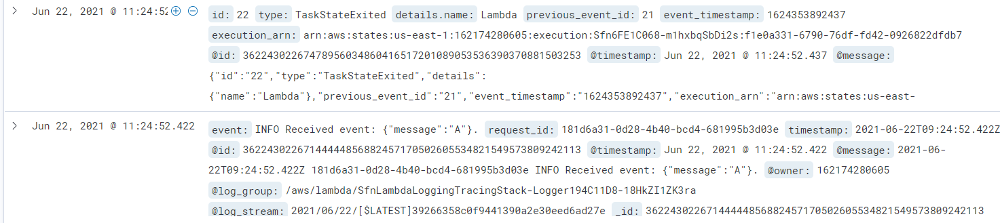
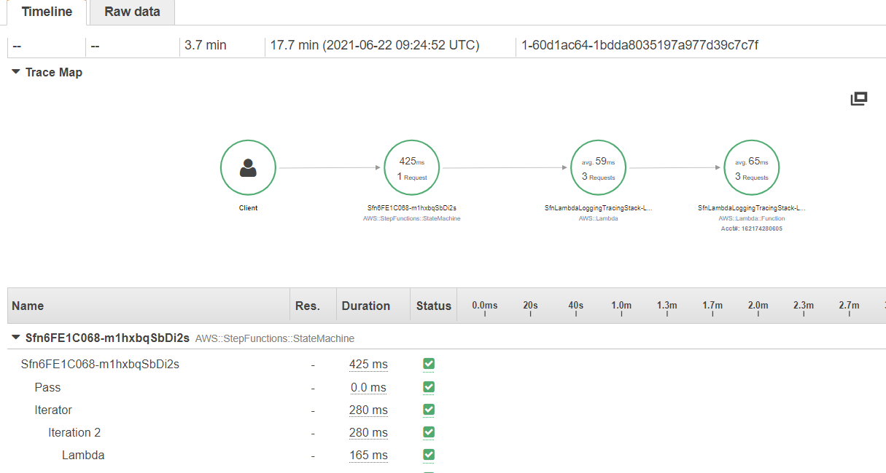

# Lambda/Step Function Logging and Tracing

This proof-of-concept creates a Step Function that iteratively calls a Lambda Function, which then just prints its input. Both these resources use built-in CloudWatch and X-Ray integrations. Additionally, the CloudWatch logs are forwarded as-is to an ElasticSearch domain using an additional Lambda function (code curtesy of AWS).

## Purpose
To show that it is possible and easy to use the built-in logging and tracing of Lambda/SFN to generate comprehensive execution traces into ElasticSearch/Kibana/X-Ray.

## Results

Kibana logs (first entry is a log from Step Functions, the next one is from Lambda):

X-Ray trace:

## Setup
You need to have NodeJS installed locally to deploy this PoC. 

Install AWS CDK: `npm i -g aws-cdk` and install the packages used in this repository: `npm ci`. 

Perform a deployment using `cdk deploy`. It will create all the needed resources. It will output the state machine name, a Lambda role ARN and the Kibana URL.

You must then log into Kibana using `admin`/`P@ssword` and grant the Lambda the right to push logs by adjusting the role mapping as shown [here](https://aws.amazon.com/tr/premiumsupport/knowledge-center/es-troubleshoot-cloudwatch-logs/#I.27m_unable_to_stream_my_CloudWatch_log_group_to_an_Amazon_ES_domain_when_fine-grained_access_control_is_enabled) (Open the menu -> Security -> Roles -> all_access -> Mapped Users -> Manage Mapping -> Backend Roles -> Enter the Role ARN -> Add another backend role -> Map).

You can then execute the Step Function (any input) and the logs will in Kibana (just map all indexes).
